# BakeBliss Bakery - Android Bakery Ordering App 🥐🧁


---

## 📌 Project Overview

**BakeBliss Bakery** is an intuitive, feature-rich Android mobile application developed for the **ICT 3219 - Mobile Application Development** module under the **Bachelor of Information and Communication Technology (BICT)** degree program at the **Department of Information and Communication Technology, Faculty of Technology, Rajarata University of Sri Lanka**.

Developed by **Team CodeSphere**, BakeBliss Bakery modernizes the traditional bakery ordering process into an elegant, digital e-commerce platform. Customers can browse bakery treats categorized across five distinct categories (Burgers, Pastries, Cakes, Buns, and Beverages), perform real-time search queries, manage their cart, select flexible payment options (Card Payment or Cash on Delivery), receive order notifications, and track their order history. In addition, an **Admin Management Portal** provides complete product **CRUD (Create, Read, Update, Delete)** functionality to keep inventory and promotions up to date.

---

## ✨ UI Showcase

<table>
  <tr>
    <td align="center"><b>Welcome</b></td>
    <td align="center"><b>Login</b></td>
    <td align="center"><b>Register</b></td>
    <td align="center"><b>Home / Catalog</b></td>
    <td align="center"><b>Item Details</b></td>
    <td align="center"><b>Cart</b></td>
  </tr>
  <tr>
    <td>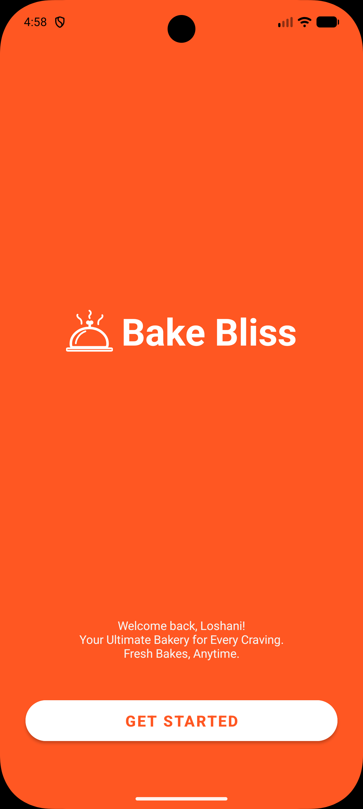</td>
    <td>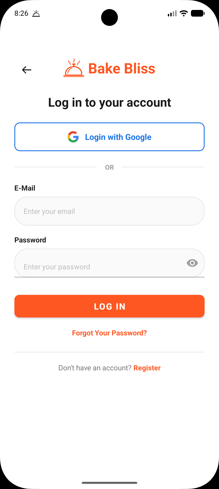</td>
    <td>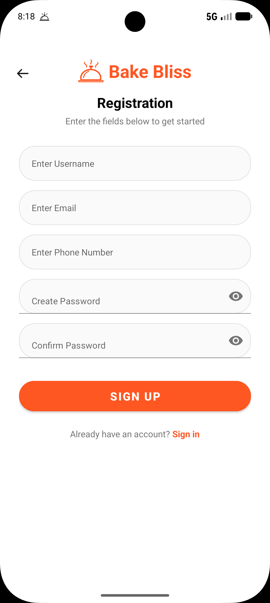</td>
    <td>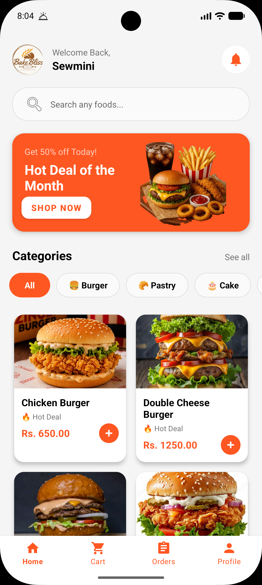</td>
    <td>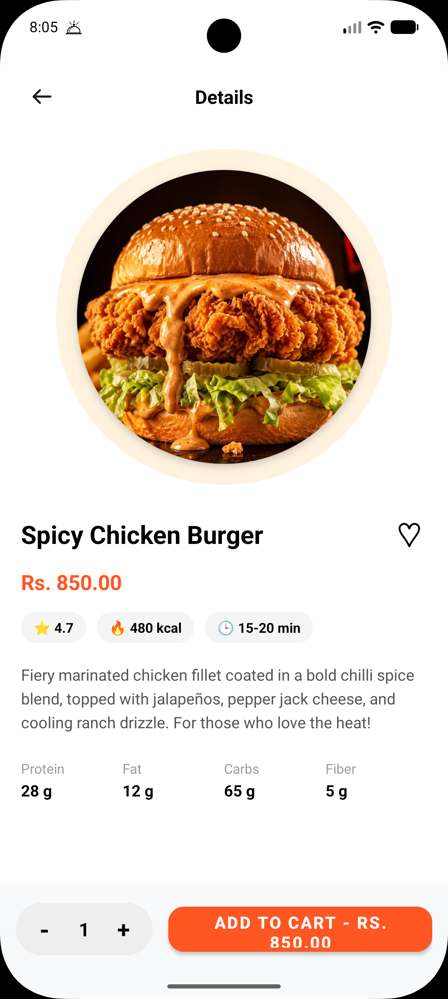</td>
    <td>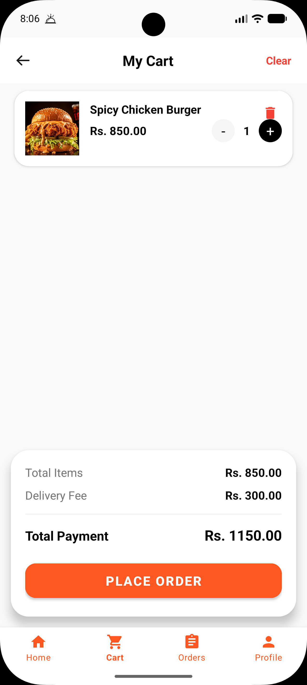</td>
  </tr>
  <tr>
    <td align="center"><b>Payment Checkout</b></td>
    <td align="center"><b>Order Confirmation</b></td>
    <td align="center"><b>My Orders</b></td>
    <td align="center"><b>Profile</b></td>
    <td align="center"><b>Edit Profile</b></td>
    <td align="center"><b>Admin Dashboard</b></td>
  </tr>
  <tr>
    <td>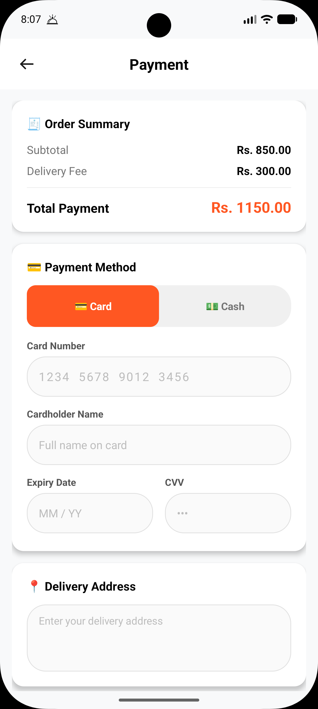</td>
    <td>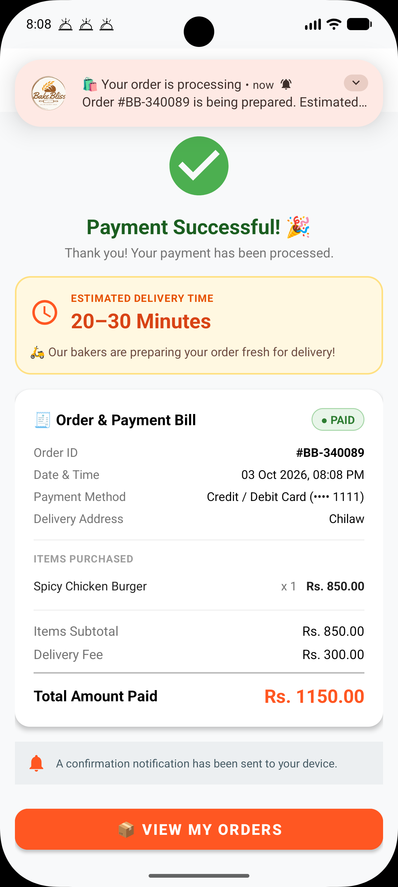</td>
    <td>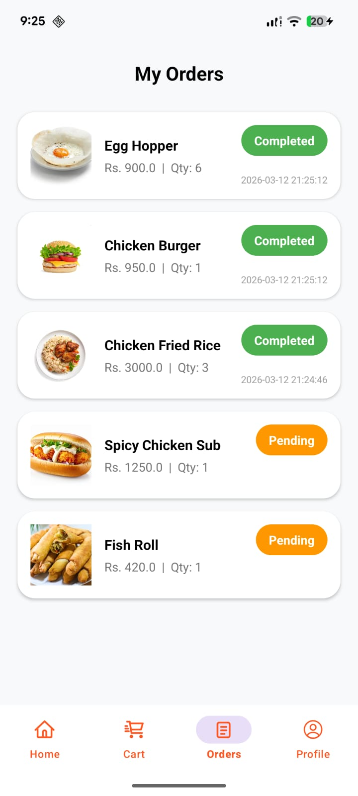</td>
    <td>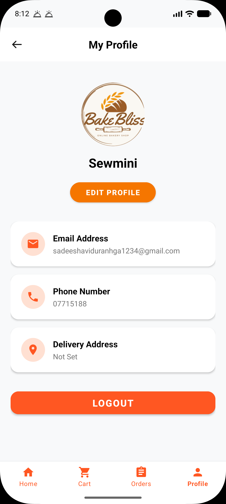</td>
    <td>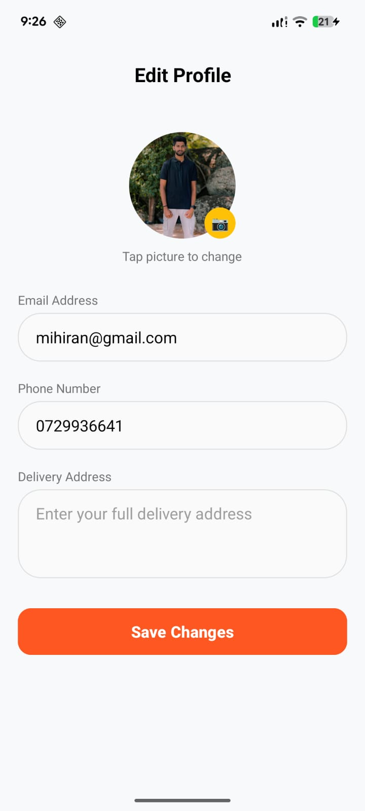</td>
    <td align="center"><i>CRUD Portal<br>(Admin Panel)</i></td>
  </tr>
</table>

---

## 🔄 System Architecture & Workflow

### Customer & Admin Workflow Diagram
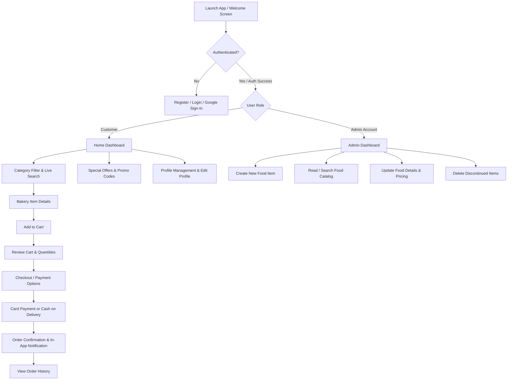

---

## 🚀 Core Features & Highlights

### 🔒 Security, Authentication & Session Control
* **Firebase Authentication:** Multi-provider authentication supporting standard Email/Password and seamless **Google Sign-In**.
* **Role-Based Redirection:** Automatic detection and routing for standard customers versus administrative accounts.
* **Strict Client-side Validation:** Enforced validations for standard email syntax, exact 10-digit phone numbers, and minimum 8-character password matching.
* **Persistent Session Management:** Safe credential persistence and auto-login state maintained via Android `SharedPreferences` (`SessionManager`).

### 🎨 Modern UI/UX Design
* **Edge-to-Edge Display:** Modern, full-screen immersive experience using Android's `EdgeToEdge` APIs and system insets handling.
* **Material Design 3:** Intuitive interface featuring custom rounded cards, responsive category chips, floating action buttons, and accessible bottom navigation.
* **Responsive Layouts:** Scrollable views, real-time UI state updates, and visual empty states when items or orders are not found.

### 🥐 Bakery Catalog & Smart Ordering
* **Dynamic Categorization:** Instant filtering across 5 core bakery categories (**Burger**, **Pastry**, **Cake**, **Bun**, and **Beverage**) plus an "All" view.
* **Instant Live Search:** Real-time text-watcher search filtering by product name.
* **Interactive Item Detail View:** View detailed item descriptions, portion counts, dynamic subtotal calculations, and one-tap additions to cart.
* **Special Offers & Hot Deals:** Dedicated promo banner with 50% discount application on selected favorites and interactive promo dialogs (`BURGER50`, `FREEDEL`, `WELCOME10`).

### 🛒 Cart & Checkout Management
* **Flexible Cart Actions:** Increase or decrease item quantities, remove specific items, or clear the entire cart.
* **Real-time Price Engine:** Automatic subtotal calculation, fixed delivery fee inclusion (Rs. 300.00), and grand total calculation.
* **Dual Payment Processing:**
  * **Card Payment:** Dedicated card validation (16-digit card number, cardholder name, MM/YY expiration format, 3-digit CVV, and delivery address).
  * **Cash on Delivery:** Convenient cash checkout option.

### 🔔 Notifications & Order History
* **Order Notifications:** System push notifications via Android `NotificationManager` (supporting Android 13+ `POST_NOTIFICATIONS` runtime permissions) confirming placed orders.
* **Unified Order Tracking:** Chronologically sorted order history displaying ordered items, order timestamps, quantities, total amounts, and visual status badges (**Completed**).

### 🛠️ Admin Management Portal (CRUD)
* **Create:** Add brand new bakery items with custom pricing, categories, descriptions, and image URLs.
* **Read:** Live catalog monitoring with item counter and real-time admin search.
* **Update:** In-place editing of item names, descriptions, prices, categories, and deal statuses.
* **Delete:** Instant removal of discontinued or out-of-stock bakery items.

### 👤 Profile Personalization
* **User Profile Dashboard:** View customer contact details, phone number, registered email, and delivery address.
* **Edit Profile:** Update personal contact details, street address, and profile picture.
* **Safe Logout:** Secure session termination and credential cleanup.

---

## 📂 Project Architecture & Directory Structure

The project follows a clean, modular Android package structure:

```text
com.example.bakebliss_bakery
│
├── activities/                  # UI Screen Controllers
│   ├── AdminActivity.java            # Admin Dashboard (Inventory monitoring & search)
│   ├── AdminAddEditFoodActivity.java # Admin CRUD controller (Add/Edit items)
│   ├── CartActivity.java             # Shopping cart management
│   ├── EditProfileActivity.java      # User profile update screen
│   ├── FoodDetailActivity.java       # Product details, quantity selector & pricing
│   ├── LoginActivity.java            # Email/Password & Google Sign-In authentication
│   ├── MyOrderActivity.java          # Order history and order status tracking
│   ├── OrderConfirmActivity.java     # Post-payment order confirmation screen
│   ├── PaymentActivity.java          # Card & Cash payment processing
│   ├── ProfileActivity.java          # User profile view & navigation
│   ├── RegisterActivity.java         # New account registration & input validation
│   └── WelcomeActivity.java          # Onboarding landing screen
│
├── adapters/                    # RecyclerView Data Binders
│   ├── AdminFoodAdapter.java         # Admin inventory adapter with edit/delete triggers
│   ├── CartAdapter.java              # Cart items adapter with quantity adjustment
│   ├── FoodAdapter.java              # Home catalog grid adapter
│   └── OrderAdapter.java             # Customer order history adapter
│
├── database/                    # Cloud Data Layer
│   └── DBHelper.java                 # Firebase Cloud Firestore helper & default seeding
│
├── models/                      # POJO Data Models
│   ├── CartModel.java                # Cart item model
│   ├── FoodModel.java                # Bakery product model (categories, deals, prices)
│   ├── OrderModel.java               # Placed order record model
│   └── User.java                     # User profile model
│
├── utils/                       # System & Helper Utilities
│   ├── NotificationHelper.java       # Notification channels & notification delivery
│   └── SessionManager.java           # SharedPreferences session handling
│
└── MainActivity.java            # Main customer catalog & home dashboard
```

---

## 🛠️ Technologies & Libraries Used

* **Platform:** Android (Min SDK: 24 / Target SDK: 37)
* **Programming Language:** Java 11
* **Cloud Database & Backend:** 
  * Google Firebase Cloud Firestore (NoSQL cloud data storage)
  * Firebase Authentication (Email/Password & Google Sign-In)
  * Firebase Cloud Storage & Analytics
* **Authentication Services:** Google Play Services Auth (`play-services-auth`, `googleid`)
* **Local Caching:** Android `SharedPreferences`
* **UI Components:** AndroidX, Material Design Components 3 (MDC), RecyclerView, CardView, ViewBinding
* **Build System:** Gradle (Kotlin DSL `build.gradle.kts`)
* **IDE:** Android Studio Ladybug / Meerkat

---

## 👥 Team Details & Work Breakdown

### Group Name: **CodeSphere**
**Module:** ICT 3219 - Mobile Application Development  
**Degree Program:** Bachelor of Information and Communication Technology (BICT)  
**Institution:** Department of Information and Communication Technology, Faculty of Technology, Rajarata University of Sri Lanka

| Index No | Registration No | Name | Role & Core Responsibilities | GitHub Profile |
| :---: | :---: | :--- | :--- | :---: |
| **2063** | ITT/2022/083 | **P.D.S. Perera** | **Project Lead & Auth/Profile:** Firebase Authentication & Google Sign-In integration, Session Management, Profile View & Edit, Edge-to-Edge UI integration | [@SewminiPerera](https://github.com/SewminiPerera) |
| **2001** | ITT/2022/020 | **B.L.L. Chathurangani** | **Menu & Catalog:** Dynamic Category Filtering (Burger, Pastry, Cake, Bun, Beverage), Real-time Live Search, Food Details screen & quantity calculations | — |
| **2054** | ITT/2022/074 | **M.N.M. Nazmy** | **Cart & Computations:** Shopping Cart UI, Increment/Decrement quantity logic, Item removal, Real-time Subtotal & Delivery Fee calculation | — |
| **2098** | ITT/2022/118 | **R.M. Yaseer** | **Payment & Notifications:** Card & Cash Payment validation, Order Confirmation flow, System Notification Helper & Promotional Alerts | — |
| **2032** | ITT/2022/052 | **K.I.P. Katugampala** | **Admin Portal & Order History:** Admin Product CRUD Operations (Create, Read, Update, Delete), Inventory management, Unified Order History | — |

---

## ⚙️ Installation & Setup Instructions

To run this project locally on your development machine:

### 1. Prerequisites
* **Android Studio** (Ladybug / Iguana or later recommended)
* **JDK 11** or higher
* Android Virtual Device (AVD) running **Android 7.0 (API level 24)** or higher, or a physical Android test device with USB debugging enabled.

### 2. Clone the Repository
```bash
git clone https://github.com/SewminiPerera/BakeBlissBakery.git
```

### 3. Open in Android Studio
1. Launch **Android Studio**.
2. Select **Open** and choose the cloned `BakeBlissBakery` directory.
3. Allow Gradle to download dependencies and sync project files.

### 4. Firebase Configuration (Optional if replacing project credentials)
* Ensure `google-services.json` is located under the `app/` directory.
* Enable **Email/Password** and **Google Sign-In** under **Firebase Console > Authentication**.
* Create a **Cloud Firestore** database in test/production mode with collections: `food_items` and `users`.

### 5. Build and Run
1. Select your emulator or connected physical Android device.
2. Click **Run** (`Shift + F10`) or select **Build > Make Project**.

---

## 📄 Academic Declaration & License

This project was developed for academic assessment purposes for the **ICT 3219 - Mobile Application Development** module at the **Faculty of Technology, Rajarata University of Sri Lanka**.

All rights reserved by **Team CodeSphere**.
